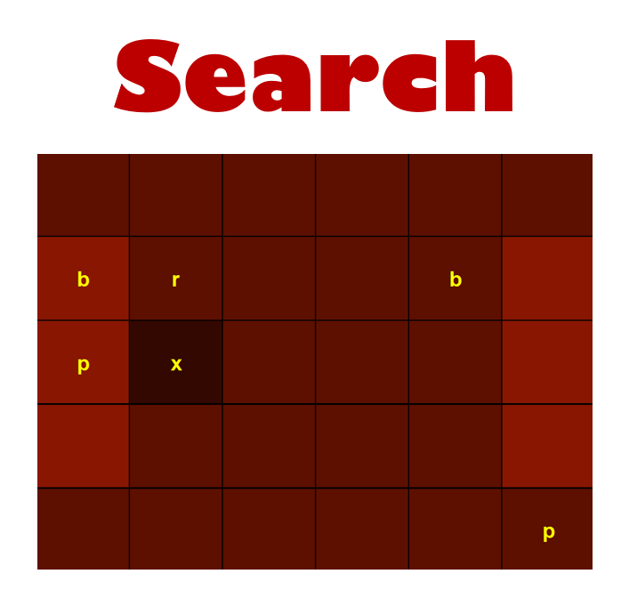

<!-- ABOUT THE PROJECT -->
## About The Project

  
 

This project is a simulation of a food table in which there are several butters and a number of applicants for butter and a robot to deliver the butters to the applicants.
The robot must finally deliver the butters to the applicants with the least battery consumption. To do this, we use IDS, Bidirectional BFS and A * search algorithms. Also, these algorithms give an error message if it is impossible to find the path. 

### Built With

* [Java](https://www.java.com)

<!-- GETTING STARTED -->
## Getting Started

First one of the search algorithms must be executed. then all the information of the environment must be given to the search algorithm in the form of several strings.After searching for the butters to the specified targets, it prints the route traveled, the cost of the route and the depth of the target mode in the terminal.
Then, by running GUI, you can see the graphic part of the project, and by pressing the next key, you can see the path that the robot takes step by step. 

<!-- CONTRIBUTING -->
## Contributing

Contributions are what make the open source community such an amazing place to learn, inspire, and create. Any contributions you make are **greatly appreciated**.

If you have a suggestion that would make this better, please fork the repo and create a pull request. You can also simply open an issue with the tag "enhancement".
Don't forget to give the project a star! Thanks again!

1. Fork the Project
2. Create your Feature Branch (`git checkout -b feature/AmazingFeature`)
3. Commit your Changes (`git commit -m 'Add some AmazingFeature'`)
4. Push to the Branch (`git push origin feature/AmazingFeature`)
5. Open a Pull Request

<!-- LICENSE -->
## License

Distributed under the MIT License. See `LICENSE.txt` for more information.

<!-- CONTACT -->
## Contact

Mina -1999minaahmadi@gmail.com

Project Link: [https://github.com/your_username/repo_name](https://github.com/MinaAhmadi77/web-HW1-Q1.git)

<!-- ACKNOWLEDGMENTS -->
## Acknowledgments

* [Java Swing Tutorial](https://www.guru99.com/java-swing-gui.html)
* [Bidirectional Search algorithm](https://www.geeksforgeeks.org/bidirectional-search/)
* [A* search algorithm](https://www.geeksforgeeks.org/a-search-algorithm/)
* [IDS rearch algorithm](https://www.geeksforgeeks.org/iterative-deepening-searchids-iterative-deepening-depth-first-searchiddfs/)

<!-- MARKDOWN LINKS & IMAGES -->
<!-- https://www.markdownguide.org/basic-syntax/#reference-style-links -->
[contributors-shield]: https://img.shields.io/github/contributors/othneildrew/Best-README-Template.svg?style=for-the-badge
[contributors-url]: https://github.com/othneildrew/Best-README-Template/graphs/contributors
[forks-shield]: https://img.shields.io/github/forks/othneildrew/Best-README-Template.svg?style=for-the-badge
[forks-url]: https://github.com/othneildrew/Best-README-Template/network/members
[stars-shield]: https://img.shields.io/github/stars/othneildrew/Best-README-Template.svg?style=for-the-badge
[stars-url]: https://github.com/othneildrew/Best-README-Template/stargazers
[issues-shield]: https://img.shields.io/github/issues/othneildrew/Best-README-Template.svg?style=for-the-badge
[issues-url]: https://github.com/othneildrew/Best-README-Template/issues
[license-shield]: https://img.shields.io/github/license/othneildrew/Best-README-Template.svg?style=for-the-badge
[license-url]: https://github.com/othneildrew/Best-README-Template/blob/master/LICENSE.txt
[linkedin-shield]: https://img.shields.io/badge/-LinkedIn-black.svg?style=for-the-badge&logo=linkedin&colorB=555
[linkedin-url]: https://linkedin.com/in/othneildrew
[product-screenshot]: images/screenshot.png
